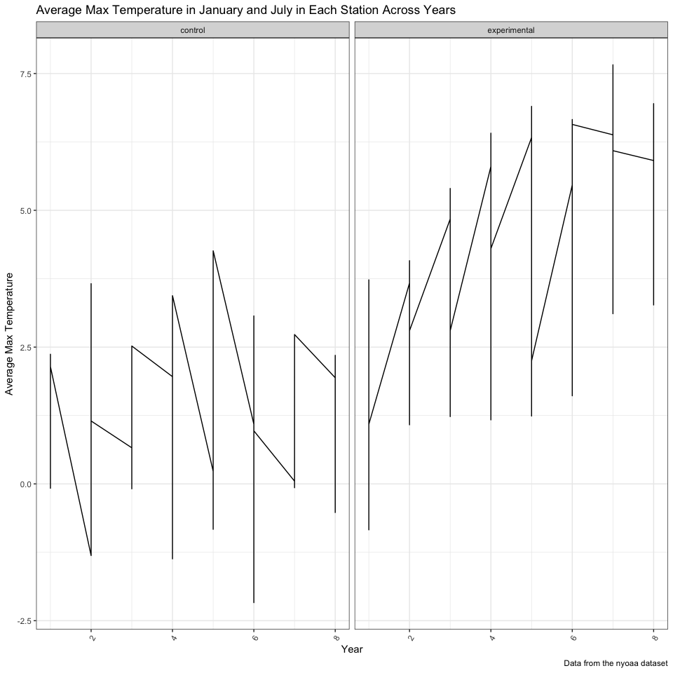

Homework \#5
================
Diana Ballesteros Gonzalez
11/7/2018

``` r
knitr::opts_chunk$set(echo = TRUE)

library(tidyverse)
```

    ## ── Attaching packages ──────────────────────────────────────────────────────── tidyverse 1.2.1 ──

    ## ✔ ggplot2 3.0.0     ✔ purrr   0.2.5
    ## ✔ tibble  1.4.2     ✔ dplyr   0.7.6
    ## ✔ tidyr   0.8.1     ✔ stringr 1.3.1
    ## ✔ readr   1.1.1     ✔ forcats 0.3.0

    ## ── Conflicts ─────────────────────────────────────────────────────────── tidyverse_conflicts() ──
    ## ✖ dplyr::filter() masks stats::filter()
    ## ✖ dplyr::lag()    masks stats::lag()

``` r
set.seed(1)

knitr::opts_chunk$set(
  fig.width = 10,
  fig.asp = 1.0,
  out.width = "90%"
)

theme_set(theme_bw() + theme(legend.position = "bottom"))
```

### **Problem 1**

This zip file contains data from a longitudinal study that included a control arm and an experimental arm. Data for each participant is included in a separate file, and file names include the subject ID and arm.

Create a tidy dataframe containing data from all participants, including the subject ID, arm, and observations over time:

Tidy the result; manipulate file names to include control arm and subject ID, make sure weekly observations are “tidy”, and do any other tidying that’s necessary Make a spaghetti plot showing observations on each subject over time, and comment on differences between groups.

``` r
#Tidying the data
tidy_problem_1_df = 
problem_1_df %>% 
  gather(key = "week", value = "score", week_1:week_8) %>% 
  mutate(week = as.numeric(str_extract(week, "\\d"))) %>% 
  separate(id, into = c("arm","id"), sep = "_") %>% 
  mutate(id = str_replace(id, ".csv", ""),
         arm = str_replace(arm, "con", "control"), 
         arm = str_replace(arm, "exp", "experimental")) 
```

Creating a spaghetti plot:

``` r
tidy_problem_1_df %>% 
  group_by(id) %>% 
  ggplot(aes(x = week, y = score, color = id)) + 
  geom_line() + geom_point() + 
  facet_grid(~arm) + 
  labs(
    title = "Spaghetti plot showing observations over times",
    x = "Week",
    y = "Observation",
    caption = "Data from the nyoaa dataset"
  ) + 
  viridis::scale_color_viridis(
    name = "ID", 
    discrete = TRUE) + 
  theme_bw()
```



Comment on differences between groups:

-   In the control group, the trend seems to remain at the same levels meanwhile the experimental groups shows observations increasing. Additionally, the experimental groups seems to have higher observation by week 8 in comparison to week 8 in the control group. Overall, the observations in the experimental group seem to be higher in comparison to the control group.

### **Problem 2**

Describe the raw data:

``` r
## Import data 
homicide_data = 
  read_csv("https://raw.githubusercontent.com/washingtonpost/data-homicides/master/homicide-data.csv") %>% 
  janitor::clean_names() %>% 
  mutate(city_state = paste(city, state, sep = ", "))
```

    ## Parsed with column specification:
    ## cols(
    ##   uid = col_character(),
    ##   reported_date = col_integer(),
    ##   victim_last = col_character(),
    ##   victim_first = col_character(),
    ##   victim_race = col_character(),
    ##   victim_age = col_character(),
    ##   victim_sex = col_character(),
    ##   city = col_character(),
    ##   state = col_character(),
    ##   lat = col_double(),
    ##   lon = col_double(),
    ##   disposition = col_character()
    ## )

Total number of homicides

``` r
homicide_data %>% 
  group_by(city_state) %>% 
  summarize(total_num_homicides = n()) %>% 
  knitr::kable()
```

| city\_state        |  total\_num\_homicides|
|:-------------------|----------------------:|
| Albuquerque, NM    |                    378|
| Atlanta, GA        |                    973|
| Baltimore, MD      |                   2827|
| Baton Rouge, LA    |                    424|
| Birmingham, AL     |                    800|
| Boston, MA         |                    614|
| Buffalo, NY        |                    521|
| Charlotte, NC      |                    687|
| Chicago, IL        |                   5535|
| Cincinnati, OH     |                    694|
| Columbus, OH       |                   1084|
| Dallas, TX         |                   1567|
| Denver, CO         |                    312|
| Detroit, MI        |                   2519|
| Durham, NC         |                    276|
| Fort Worth, TX     |                    549|
| Fresno, CA         |                    487|
| Houston, TX        |                   2942|
| Indianapolis, IN   |                   1322|
| Jacksonville, FL   |                   1168|
| Kansas City, MO    |                   1190|
| Las Vegas, NV      |                   1381|
| Long Beach, CA     |                    378|
| Los Angeles, CA    |                   2257|
| Louisville, KY     |                    576|
| Memphis, TN        |                   1514|
| Miami, FL          |                    744|
| Milwaukee, wI      |                   1115|
| Minneapolis, MN    |                    366|
| Nashville, TN      |                    767|
| New Orleans, LA    |                   1434|
| New York, NY       |                    627|
| Oakland, CA        |                    947|
| Oklahoma City, OK  |                    672|
| Omaha, NE          |                    409|
| Philadelphia, PA   |                   3037|
| Phoenix, AZ        |                    914|
| Pittsburgh, PA     |                    631|
| Richmond, VA       |                    429|
| Sacramento, CA     |                    376|
| San Antonio, TX    |                    833|
| San Bernardino, CA |                    275|
| San Diego, CA      |                    461|
| San Francisco, CA  |                    663|
| Savannah, GA       |                    246|
| St. Louis, MO      |                   1677|
| Stockton, CA       |                    444|
| Tampa, FL          |                    208|
| Tulsa, AL          |                      1|
| Tulsa, OK          |                    583|
| Washington, DC     |                   1345|

Number of unsolved homicides

``` r
homicide_data %>% 
  filter(disposition == "Closed without arrest" | disposition == "Open/No arrest") %>% 
  group_by(city_state) %>% 
  summarize(num_unsolved_homicides = n()) %>% 
  knitr::kable()
```

| city\_state        |  num\_unsolved\_homicides|
|:-------------------|-------------------------:|
| Albuquerque, NM    |                       146|
| Atlanta, GA        |                       373|
| Baltimore, MD      |                      1825|
| Baton Rouge, LA    |                       196|
| Birmingham, AL     |                       347|
| Boston, MA         |                       310|
| Buffalo, NY        |                       319|
| Charlotte, NC      |                       206|
| Chicago, IL        |                      4073|
| Cincinnati, OH     |                       309|
| Columbus, OH       |                       575|
| Dallas, TX         |                       754|
| Denver, CO         |                       169|
| Detroit, MI        |                      1482|
| Durham, NC         |                       101|
| Fort Worth, TX     |                       255|
| Fresno, CA         |                       169|
| Houston, TX        |                      1493|
| Indianapolis, IN   |                       594|
| Jacksonville, FL   |                       597|
| Kansas City, MO    |                       486|
| Las Vegas, NV      |                       572|
| Long Beach, CA     |                       156|
| Los Angeles, CA    |                      1106|
| Louisville, KY     |                       261|
| Memphis, TN        |                       483|
| Miami, FL          |                       450|
| Milwaukee, wI      |                       403|
| Minneapolis, MN    |                       187|
| Nashville, TN      |                       278|
| New Orleans, LA    |                       930|
| New York, NY       |                       243|
| Oakland, CA        |                       508|
| Oklahoma City, OK  |                       326|
| Omaha, NE          |                       169|
| Philadelphia, PA   |                      1360|
| Phoenix, AZ        |                       504|
| Pittsburgh, PA     |                       337|
| Richmond, VA       |                       113|
| Sacramento, CA     |                       139|
| San Antonio, TX    |                       357|
| San Bernardino, CA |                       170|
| San Diego, CA      |                       175|
| San Francisco, CA  |                       336|
| Savannah, GA       |                       115|
| St. Louis, MO      |                       905|
| Stockton, CA       |                       266|
| Tampa, FL          |                        95|
| Tulsa, OK          |                       193|
| Washington, DC     |                       589|
