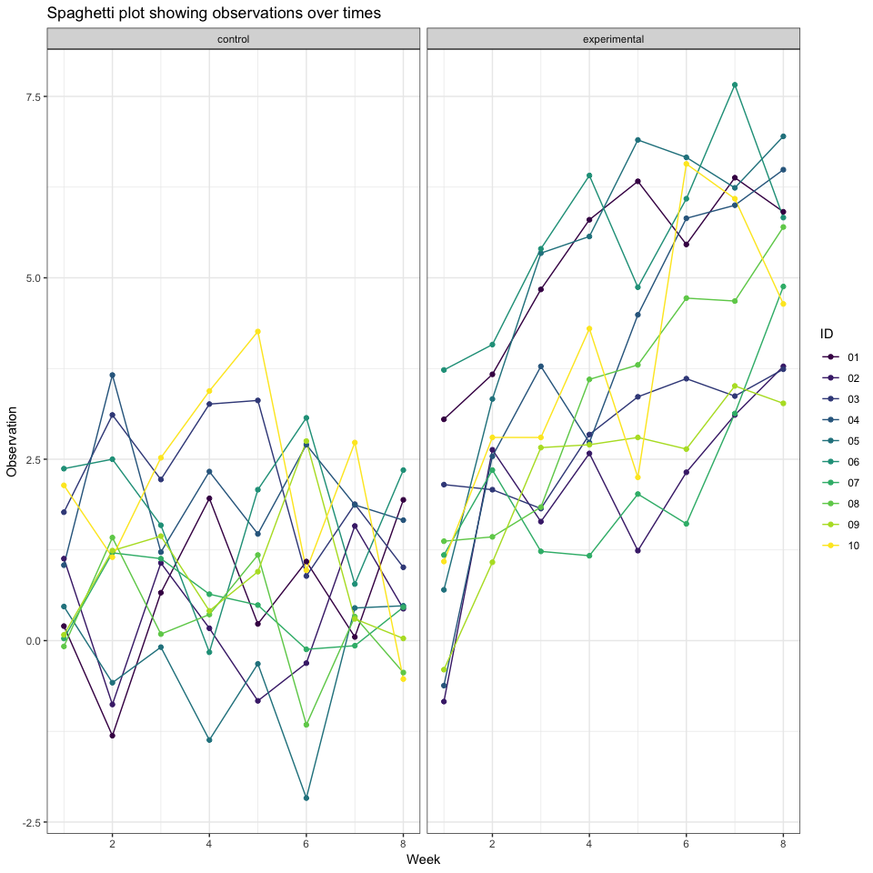

Homework \#5
================
Diana Ballesteros Gonzalez
11/7/2018

``` r
knitr::opts_chunk$set(echo = TRUE)

library(tidyverse)
```

    ## ── Attaching packages ──────────────────────────────────────────────────────── tidyverse 1.2.1 ──

    ## ✔ ggplot2 3.0.0     ✔ purrr   0.2.5
    ## ✔ tibble  1.4.2     ✔ dplyr   0.7.6
    ## ✔ tidyr   0.8.1     ✔ stringr 1.3.1
    ## ✔ readr   1.1.1     ✔ forcats 0.3.0

    ## ── Conflicts ─────────────────────────────────────────────────────────── tidyverse_conflicts() ──
    ## ✖ dplyr::filter() masks stats::filter()
    ## ✖ dplyr::lag()    masks stats::lag()

``` r
set.seed(1)

knitr::opts_chunk$set(
  fig.width = 10,
  fig.asp = 1.0,
  out.width = "90%"
)

theme_set(theme_bw() + theme(legend.position = "bottom"))
```

### **Problem 1**

This zip file contains data from a longitudinal study that included a control arm and an experimental arm. Data for each participant is included in a separate file, and file names include the subject ID and arm.

Create a tidy dataframe containing data from all participants, including the subject ID, arm, and observations over time:

Tidy the result; manipulate file names to include control arm and subject ID, make sure weekly observations are “tidy”, and do any other tidying that’s necessary Make a spaghetti plot showing observations on each subject over time, and comment on differences between groups.

``` r
#Tidying the data
tidy_problem_1_df = 
problem_1_df %>% 
  gather(key = "week", value = "score", week_1:week_8) %>% 
  mutate(week = as.numeric(str_extract(week, "\\d"))) %>% 
  separate(id, into = c("arm","id"), sep = "_") %>% 
  mutate(id = str_replace(id, ".csv", ""),
         arm = str_replace(arm, "con", "control"), 
         arm = str_replace(arm, "exp", "experimental")) 
```

Creating a spaghetti plot:

``` r
tidy_problem_1_df %>% 
  group_by(id) %>% 
  ggplot(aes(x = week, y = score, color = id)) + 
  geom_line() + geom_point() + 
  facet_grid(~arm) + 
  labs(
    title = "Spaghetti plot showing observations over times",
    x = "Week",
    y = "Observation",
    caption = "Data from the nyoaa dataset"
  ) + 
  viridis::scale_color_viridis(
    name = "ID", 
    discrete = TRUE) + 
  theme_bw()
```



Comment on differences between groups:

-   In the control group, the trend seems to remain at the same levels meanwhile the experimental groups shows observations increasing. Additionally, the experimental groups seems to have higher observation by week 8 in comparison to week 8 in the control group. Overall, the observations in the experimental group seem to be higher in comparison to the control group.
